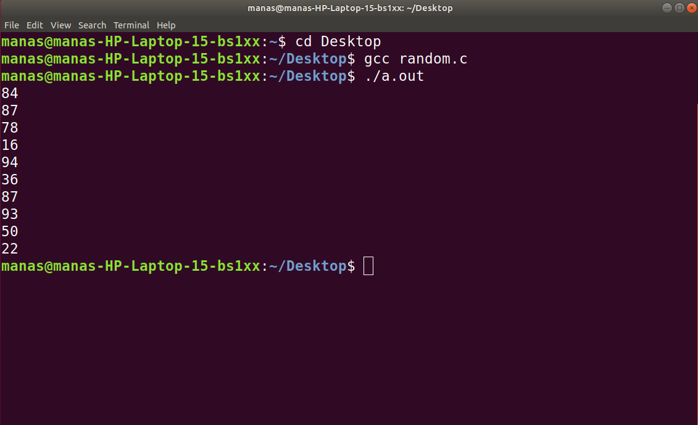

Name|Roll Number|Class|Batches (Prac/Tut)|
:---:|:---:|:---:|:---:
**Manas Ajay Peshwe**|**216**|**SEB**|**S1/T1**

This is an recursive program for **BINARY SEARCH** :
<br>
```c
char s[] = "c "
#include<stdio.h>
#include<stdlib.h>
void main(){
        int n;
        for(int i=0 ; i<10 ; i++){
                    n =rand()%100 +1;
                    printf("%d\n",n);
        }
}       
     

//This is awesome!
```
The **OUTPUT** of the above Program is :
<br>
<center>

</center>
