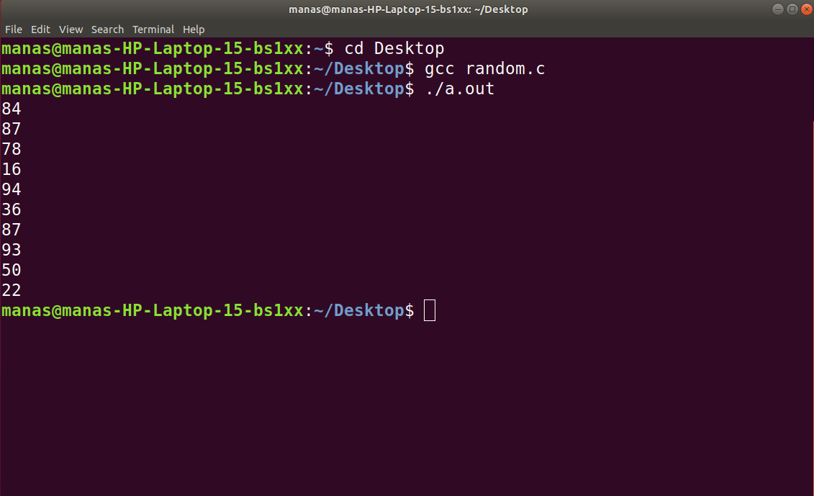
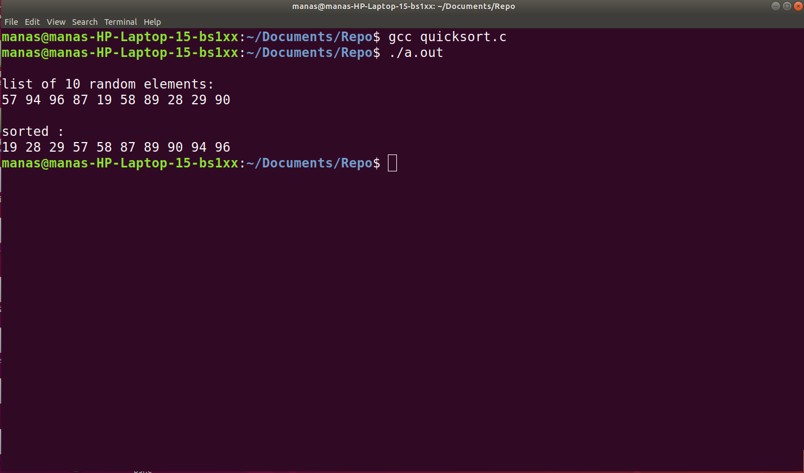

Name|Roll Number|Class|Batches (Prac/Tut)|
:---:|:---:|:---:|:---:
**Manas Ajay Peshwe**|**216**|**SEB**|**S1/T1**

This is an recursive program for **BINARY SEARCH** :
<br>
```c
#include<stdio.h>
#include<stdlib.h>
void main(){
        int n;
        for(int i=0 ; i<10 ; i++){
                    n =rand()%100 +1;
                    printf("%d\n",n);
        }
}       

//This is awesome!
```

The **OUTPUT** of the above Program is :
<br>
<center>

</center>

The **Program for QUICK SORT** :
```c
#include<stdio.h>
#include<stdlib.h>
//Just for swapping stuff.
void swap(int*m ,int* j){
        int temp;
        temp = *m;
        *m = *j;
        *j = temp;
}
//Just to display the list ~~~
void display(int a[]){
        for(int x =0 ; x<10 ; x++){
                printf("%d ",a[x]);
        }
        printf("\n");
}                       
int sort(int* a , int low, int high){
        int pivot = a[high];
        int i = (low - 1);
        for(int j = low ; j<=high-1; j++){
                if(a[j] <= pivot){
                        i++;
                       swap(&a[i],&a[j]);
                 }
        }
        swap(&a[i+1],&a[high]);
        return(i+1);
}
void partition(int a[] , int low, int high){
        int p;
        if(low < high){
                p = sort(a,low,high);//p is the position of our pivot!

                partition(a,low,p-1); // sort the right side of pivot by the same tecnique
                partition(a,p+1,high);// sort Left sideof the pivot
        }
}
void main(){
        int a[10],high ;
        printf("\nlist of 10 random elements:\n");
        for(int i=0 ;i<10;i++){
                a[i]= (int)rand()%97+rand()%11+1;
        }
        display(a);
        high = 9;
        partition(a,0,high);
        printf("\nsorted :\n");
        display(a);      
}
```
The **OUTPUT** of the QUICKSORT program is :
<center>

</center>
